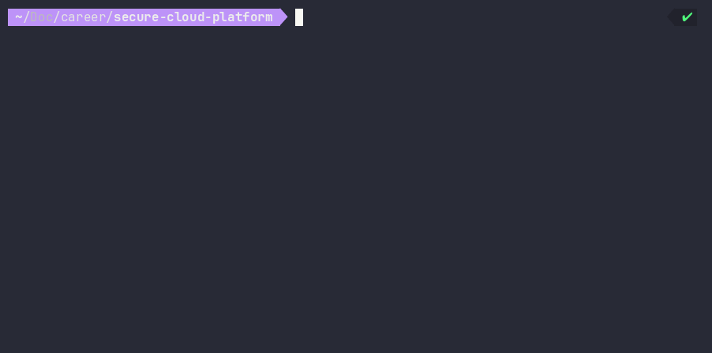

# Secure Cloud Platform

[](https://www.python.org/)
[](https://www.terraform.io/)
[](https://aws.amazon.com/)

**An end-to-end cloud environment automation project showcasing Infrastructure as Code (IaC) principles and custom CLI tooling.**



## Overview

The **Secure Cloud Platform** is a two-part project designed to demonstrate production-ready cloud engineering skills. It combines a robust **Terraform** infrastructure setup on AWS with `cloudctl`, a custom **Python CLI application** built to abstract and orchestrate infrastructure deployments.

I built this abstraction to solve the problem of developer friction when deploying AWS environments. Instead of expecting them to understand Terraform state files and raw HCL, they can leverage `cloudctl` to run validations, deploy and securely destroy  infrastructure, query status, and handle secure connectivity. This configuration mirrors how internal developer platforms (IDPs) are built in modern enterprise environments.

## Project Structure

This project is separated into two primary micro-components. **Please see their respective READMEs for detailed documentation and local setup instructions:**

* **[`/terraform/README.md`](terraform/README.md):** The IaC backbone. Defines the AWS VPC, subnets, EC2 instances, security groups, and automated Bash bootstrapping scripts.
* **[`/cloudctl/README.md`](cloudctl/README.md):** The Python CLI control plane. Manages the Terraform lifecycle, handles configuration (`settings.yaml`), and provides commands like `deploy`, `status`, and `destroy`.

## Key Technical Achievements 

* **DevOps & CI/CD Readiness:** Built an automated Python pipeline to orchestrate Terraform. `cloudctl` is highly extensible and easily integratable into CI/CD systems like GitHub Actions or Jenkins.
* **Security & Least Privilege:** Configured strict network segmentation and utilized IAM Instance Profiles rather than hardcoded API keys. Implemented IMDSv2 (Server-Side Request Forgery protection) on compute nodes.
* **Idempotency & State Management:** `cloudctl deploy` relies on Terraform's idempotency, ensuring safe, repeatable runs that only change necessary resources. Infrastructure state is secured using an S3 backend.

## Quick Start

1. Ensure you have **AWS credentials** configured locally, along with **Python 3.9+** and **Terraform** installed.
2. Clone the repository and navigate to the project root.
3. Install the CLI dependencies:
   ```bash
   cd cloudctl
   python3 -m venv .venv
   source .venv/bin/activate
   pip install -r requirements.txt
   ```
4. Update `cloudctl/config/settings.yaml` with your SSH key path, user, and `allowed_cidr` (your public IP in `/32` form).
5. Deploy the infrastructure using the custom tool:
   ```bash
   python3 main.py deploy
   ```

---
*Created by Richard Romero | [LinkedIn](https://www.linkedin.com/in/richardromero15/)*
