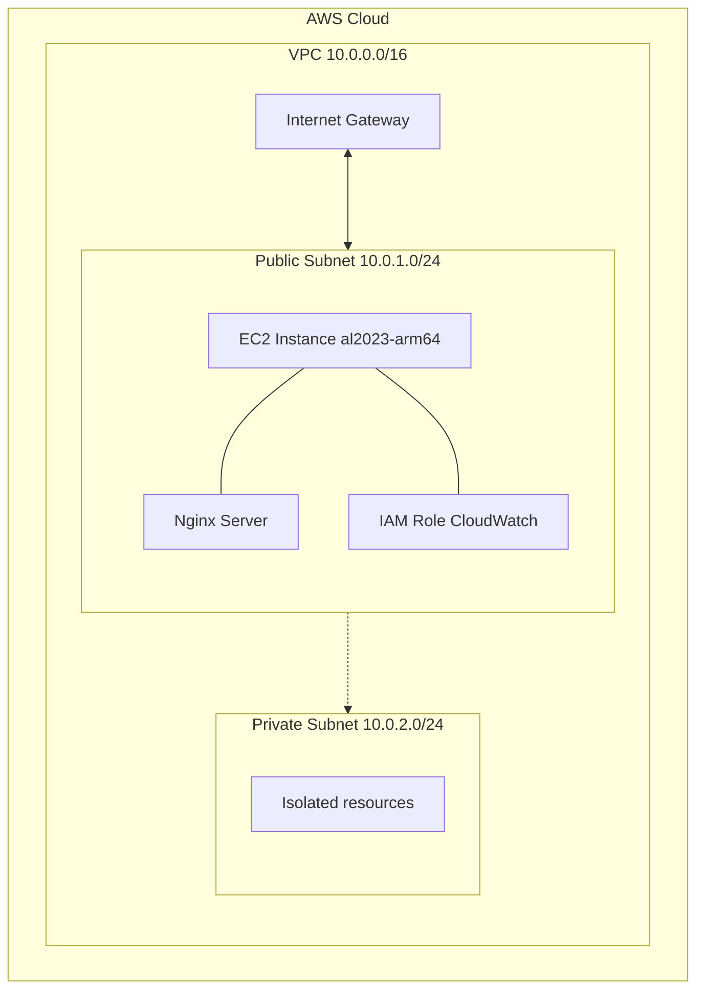

# Secure Cloud DevOps Platform

**Infrastructure-as-Code AWS environment with automated deployment, networking, and security controls.**

## Architecture Overview

This project sets up a secure, highly-available foundation in AWS using Terraform. It provisions a custom VPC with both public and private subnets, configuring routing and an Internet Gateway for external access. An EC2 instance is deployed into the public subnet and bootstrapped automatically.

* **Terraform** provisions all AWS infrastructure components.
* **Bash user-data** automates the installation and configuration of an Nginx web server on boot.
* **IAM Instance Profiles** are attached with CloudWatch policies for automated monitoring rights.
* **Network topology** spans a VPC with isolated public (10.0.1.0/24) and private (10.0.2.0/24) subnets.

## Tech Stack

* **AWS** (EC2, VPC, IAM, CloudWatch)
* **Terraform** (Infrastructure as Code)
* **Linux** (Amazon Linux 2023 ARM64)
* **Bash Scripting** (Server bootstrapping)
* **Nginx** (Web server)

## Features

* **Infrastructure Provisioning:** Fully automated deployment of VPC, subnets, route tables, and gateways.
* **Automated Bootstrapping:** EC2 instances are pre-configured with Nginx via `user_data.sh`.
* **IAM Least-Privilege:** EC2 instances use attached roles rather than hardcoded credentials.
* **Network Segmentation:** Defined Public & Private subnets with highly restrictive Security Groups (e.g., SSH restricted to a specific IP, Web access enabled on port 80).
* **Prepared for Observability:** EC2 Roles are pre-configured with the `CloudWatchAgentServerPolicy` for advanced metrics and logging.

## Architecture Diagram

(Basic network flow overview to demonstrate component relationships)

## Deployment Workflow

1. **Initialization:** Run `terraform init && terraform apply`.
2. **Network Provisioning:** Primary AWS VPC, subnets, and gateways are constructed.
3. **Security Setup:** Granular Security Groups and IAM Roles are established.
4. **Compute Launch:** EC2 instance is launched into the public subnet.
5. **Bootstrapping:** Data script (`user_data.sh`) executes automatically on boot.
6. **Service Ready:** Nginx is installed, activated, and the web server comes online.

## Security Considerations

* **IAM Roles over Static Credentials:** Compute resources use instance profiles mapped strictly to defined policies.
* **Restricted SSH Access:** Port 22 inbound rules are locked down to a single specific IP (`24.170.200.152`).
* **Subnet Segmentation:** Resources that don't need internet accessibility can be stored in the pre-configured private subnet.
* **Instance Metadata Service:** Implemented `http_tokens = "required"` (IMDSv2) to prevent SSRF vulnerabilities.

## Lessons Learned

* **Automating AWS cloud infrastructure:** Using IaC to automate the creation of many AWS services, increasing traceability and reproducibility.
* **Managing Terraform state safely:** Understanding how file and resource changes affect terraform state.
* **Importance of deployment scripts:** Ensuring Terraform can apply updates cleanly by tracking script hashes with `terraform_data.user_data_hash`.
