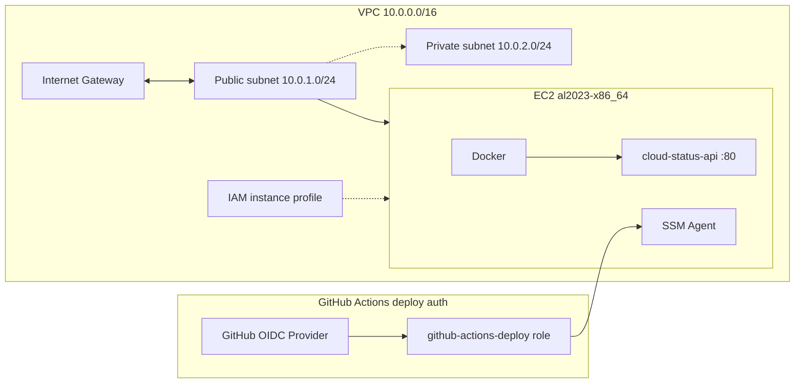

# Secure Cloud DevOps Platform (Terraform Infrastructure)

**Infrastructure-as-Code AWS environment with automated deployment, networking, and security controls.**

## Architecture Overview

This project sets up a secure foundation in AWS using Terraform. It provisions a custom VPC with public and private subnets, an Internet Gateway, and an EC2 instance in the public subnet that serves as a Docker host for the [`cloud-status-api`](../app/README.md) container.

* **Terraform** provisions all AWS infrastructure components.
* **Bash user-data** bootstraps the EC2 host with Docker, the SSM agent, and the CloudWatch agent.
* **IAM instance profiles** grant the EC2 host CloudWatch and SSM permissions without static credentials.
* **GitHub OIDC** (`github_actions.tf`) lets GitHub Actions assume a short-lived IAM role for SSM-based deploys.
* **Network topology** spans a VPC with isolated public (10.0.1.0/24) and private (10.0.2.0/24) subnets.
* **Remote backend** stores Terraform state in S3 for reliable, shared management.

## Tech Stack

* **AWS** (EC2, VPC, IAM, SSM, CloudWatch, S3)
* **Terraform** (Infrastructure as Code, remote state)
* **Linux** (Amazon Linux 2023 x86_64)
* **Bash** (server bootstrapping via `user_data.sh`)

## Features

* **Infrastructure provisioning:** Automated deployment of VPC, subnets, route tables, and gateways.
* **Remote state management:** `terraform.tfstate` stored in S3 to prevent local data loss.
* **Compute bootstrap:** EC2 hosts pre-configured with Docker and SSM via [`user_data.sh`](user_data.sh).
* **IAM least privilege:** EC2 uses instance profiles; GitHub Actions uses a scoped OIDC deploy role.
* **Network segmentation:** Public and private subnets with restrictive security groups (SSH limited to your IP, HTTP on port 80).
* **Observability readiness:** EC2 role includes `CloudWatchAgentServerPolicy`.

## Compute Bootstrap (`user_data.sh`)

On first boot, the EC2 instance runs [`user_data.sh`](user_data.sh):

1. **SSM agent** — registers the instance with AWS Systems Manager so CI can deploy without opening SSH to GitHub runners.
2. **Docker** — container runtime for `cloud-status-api`.
3. **CloudWatch agent** — metrics and logging readiness.

No application code runs in user-data; the app is deployed separately via `cloudctl` or GitHub Actions.

## GitHub Actions Integration

[`github_actions.tf`](github_actions.tf) provisions CI/CD infrastructure:

* **OIDC provider** — federated trust for `token.actions.githubusercontent.com`.
* **Deploy role** — assumable only from the configured GitHub repo and `production` environment.
* **Role permissions** — `ssm:SendCommand` (scoped to instances tagged `ManagedBy=terraform`), `ssm:GetCommandInvocation`, and `ec2:DescribeInstances`.

The EC2 instance profile includes `AmazonSSMManagedInstanceCore` (see [`main.tf`](main.tf)) so SSM commands can reach the host.

After `terraform apply`, use the output for GitHub setup:

```bash
terraform output github_actions_role_arn
```

Set that value as `AWS_ROLE_ARN` in the GitHub `production` environment. Full setup steps are in the root [GitHub Secrets & CI Deploy](../README.md#github-secrets--ci-deploy) section.

## Architecture Diagram



HTTP traffic flows **Internet Gateway ↔ public subnet ↔ EC2** to reach the app. GitHub Actions assumes the deploy role via OIDC and sends commands **to the SSM Agent** running on the host (not from EC2 to SSM). During rolling deploys, staging uses host port **8080**; production serves on **80** (container port **8000**).

## Security Considerations

* **IAM roles over static credentials:** EC2 uses instance profiles; GitHub Actions uses OIDC with no long-lived AWS keys.
* **Instance metadata service:** `http_tokens = "required"` (IMDSv2) on the EC2 instance to mitigate SSRF.
* **State file security:** Remote S3 backend keeps sensitive infrastructure data out of the repo.
* **SSH restricted:** Port 22 limited to your `allowed_cidr`; CI deploys via SSM instead.

## Related Docs

* **Application API** — [`app/README.md`](../app/README.md)
* **CLI deploy and validation** — [`cloudctl/README.md`](../cloudctl/README.md)
* **CI/CD setup and workflow** — [`README.md`](../README.md#github-secrets--ci-deploy)
